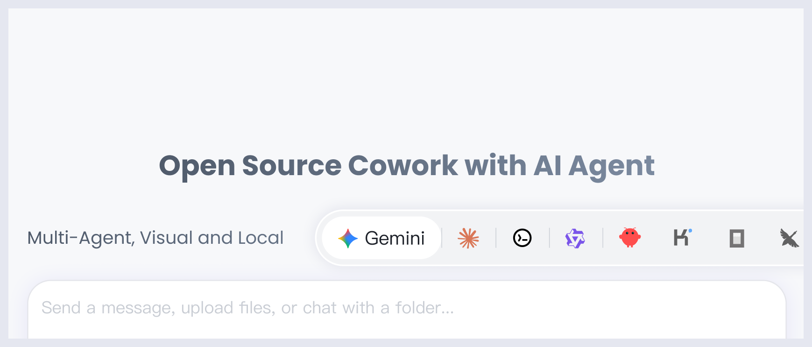

<p align="center">
  
</p>

<p align="center">
  
  &nbsp;
  
  &nbsp;
  
</p>
---

<p align="center">
  <strong>무료 오픈소스 AI Agent 협업 앱</strong><br>
  <em>기본 제공 Agent | 제로 설정 | 모든 API Key | 멀티 Agent | 원격 액세스 | 크로스 플랫폼 | 24/7 자동화</em>
</p>

<p align="center">
  <a href="https://github.com/dustinwloring1988/agent-ui/releases">
    
  </a>
</p>

<p align="center">
  <a href="./readme.md">English</a> | <a href="./readme_ch.md">简体中文</a> | <a href="./readme_tw.md">繁體中文</a> | <a href="./readme_jp.md">日本語</a> | <strong>한국어</strong> | <a href="./readme_es.md">Español</a> | <a href="./readme_pt.md">Português</a> | <a href="./readme_tr.md">Türkçe</a> | <a href="https://github.com/dustinwloring1988/agent-ui" target="_blank">공식 웹사이트</a>
</p>

<p align="center">
  <strong>커뮤니티:</strong> <a href="https://discord.gg/bJSdUDb8" target="_blank">Discord (English)</a> | <a href="https://twitter.com/AgentUi" target="_blank">Twitter</a>
</p>

---

## 📋 빠른 탐색

<p align="center">

[빠른 시작](#빠른-시작) ·
[커뮤니티](#커뮤니티--지원)

</p>

---

## 빠른 시작

### 시스템 요구사항

- **macOS**: 10.15 이상
- **Windows**: Windows 10 이상
- **Linux**: Ubuntu 18.04+ / Debian 10+ / Fedora 32+
- **메모리**: 4GB 이상 권장
- **저장공간**: 500MB 이상 여유 공간

### 설치

<p>
  <a href="https://github.com/dustinwloring1988/agent-ui/releases">
    
  </a>
</p>

```bash
# macOS Homebrew로 설치
brew install aionui
```

### 3단계로 시작하기

1. **설치** AionUi
2. **로그인** Google 계정 또는 원하는 API Key 입력
3. **협업 시작** — 기본 제공 AI Agent 준비 완료

### 상세 가이드

<details>
<summary><strong>전체 사용 가이드 보기</strong></summary>

<br>

**빠른 시작**

- [전체 설치 가이드](https://github.com/dustinwloring1988/agent-ui/wiki/Getting-Started) — 다운로드부터 설정까지 자세한 단계
- [LLM 설정 가이드](https://github.com/dustinwloring1988/agent-ui/wiki/LLM-Configuration) — 멀티 플랫폼 AI 모델 설정
- [멀티 에이전트 모드 설정](https://github.com/dustinwloring1988/agent-ui/wiki/ACP-Setup) — 터미널 AI Agent 통합
- [MCP 도구 설정](https://github.com/dustinwloring1988/agent-ui/wiki/MCP-Configuration-Guide) — 모델 컨텍스트 프로토콜 서버 설정
- [WebUI 설정 가이드](https://github.com/dustinwloring1988/agent-ui/wiki/WebUI-Configuration-Guide) — 전체 WebUI 설정 및 구성 튜토리얼

**사용 사례**

- [파일 관리](https://github.com/dustinwloring1988/agent-ui/wiki/file-management) — 스마트 파일 정리
- [Excel 처리](https://github.com/dustinwloring1988/agent-ui/wiki/excel-processing) — AI 기반 데이터 처리
- [이미지 생성](https://github.com/dustinwloring1988/agent-ui/wiki/AionUi-Image-Generation-Tool-Model-Configuration-Guide) — AI 이미지 생성
- [더 많은 사용 사례](https://github.com/dustinwloring1988/agent-ui/wiki/Use-Cases-Overview)

**지원 및 도움말**

- [FAQ](https://github.com/dustinwloring1988/agent-ui/wiki/FAQ) — 질문 및 문제 해결
- [설정 및 사용 튜토리얼](https://github.com/dustinwloring1988/agent-ui/wiki/Configuration-Guides) — 전체 설정 문서

</details>

---

## 커뮤니티와 지원

### 기여 방법

1. 이 프로젝트 Fork
2. 기능 브랜치 생성 (`git checkout -b feature/AmazingFeature`)
3. 변경 사항 커밋 (`git commit -m 'Add some AmazingFeature'`)
4. 브랜치에 푸시 (`git push origin feature/AmazingFeature`)
5. Pull Request 열기

---

## 라이선스

이 프로젝트는 [Apache-2.0](LICENSE) 라이선스 하에 라이선스되었습니다.

---

## 기여자

<p align="center">
  <a href="https://github.com/dustinwloring1988/agent-ui/graphs/contributors">
    
  </a>
</p>

## 별점 기록

<p align="center">
  <a href="https://www.star-history.com/#dustinwloring1988/agent-ui&Date" target="_blank">
    
  </a>
</p>

<div align="center">

**좋아하시면 별을 주세요**

[버그 신고](https://github.com/dustinwloring1988/agent-ui/issues) · [기능 요청](https://github.com/dustinwloring1988/agent-ui/issues)

</div>
